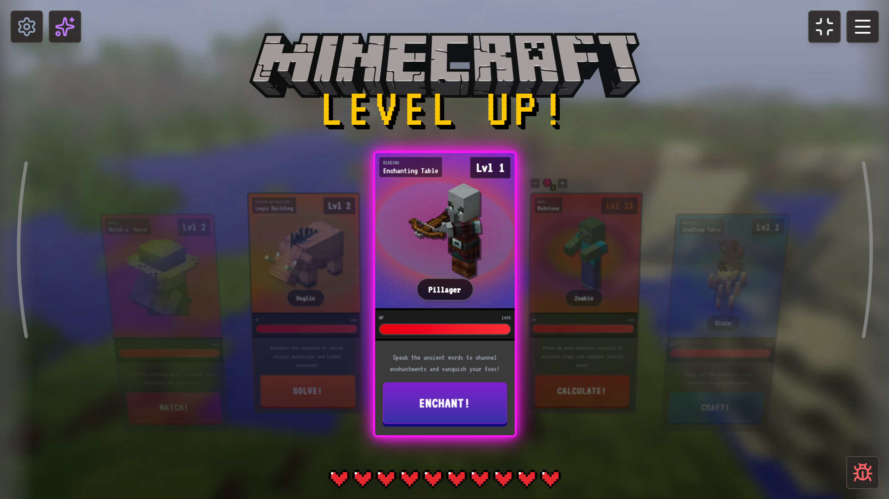
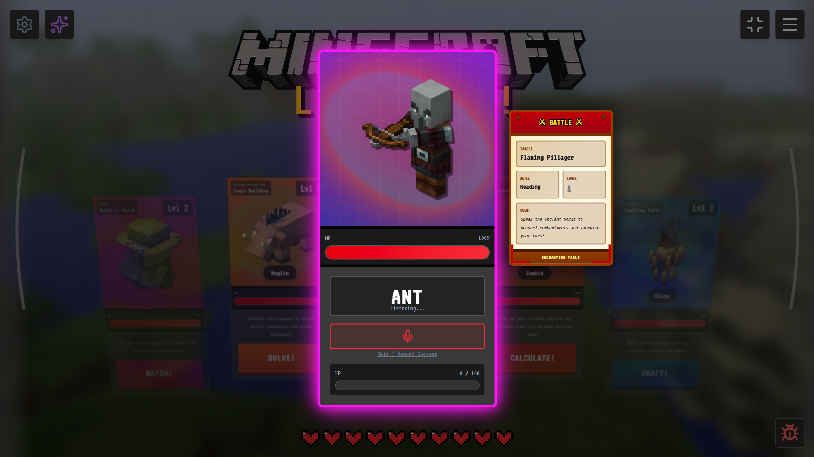
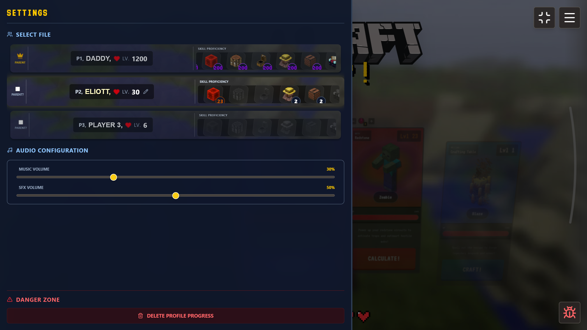
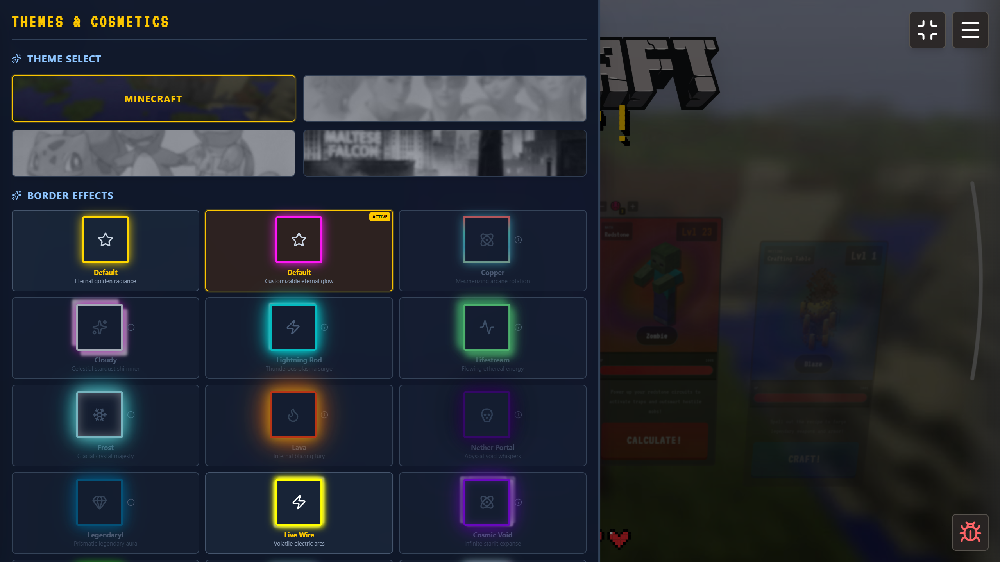
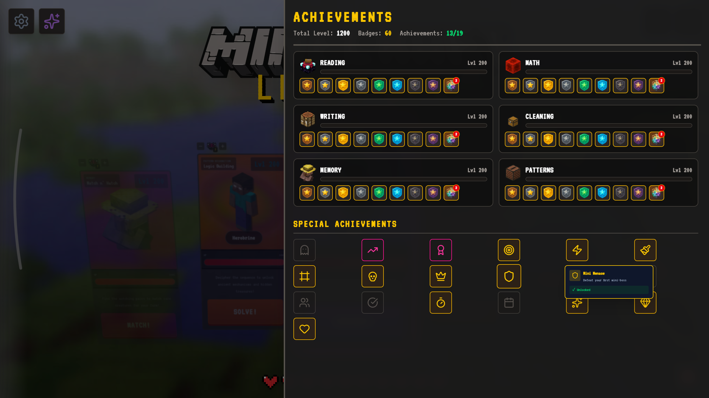
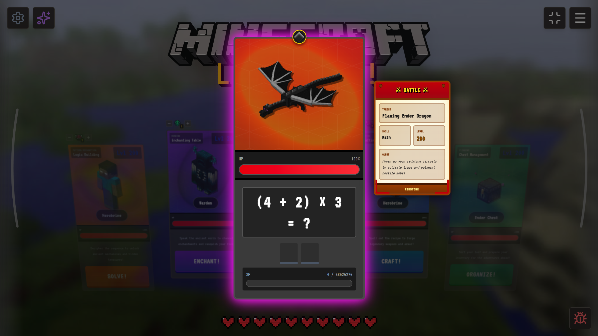
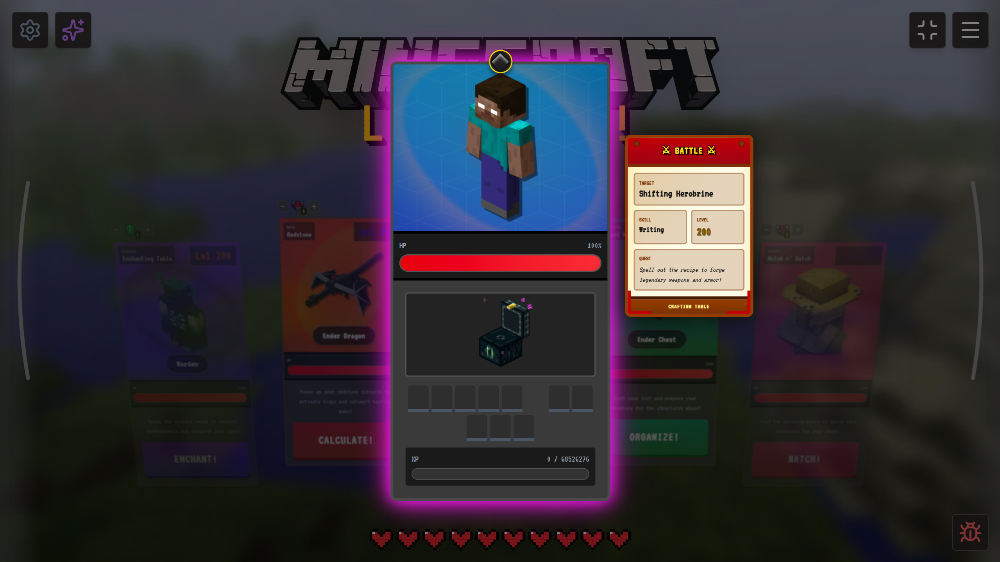
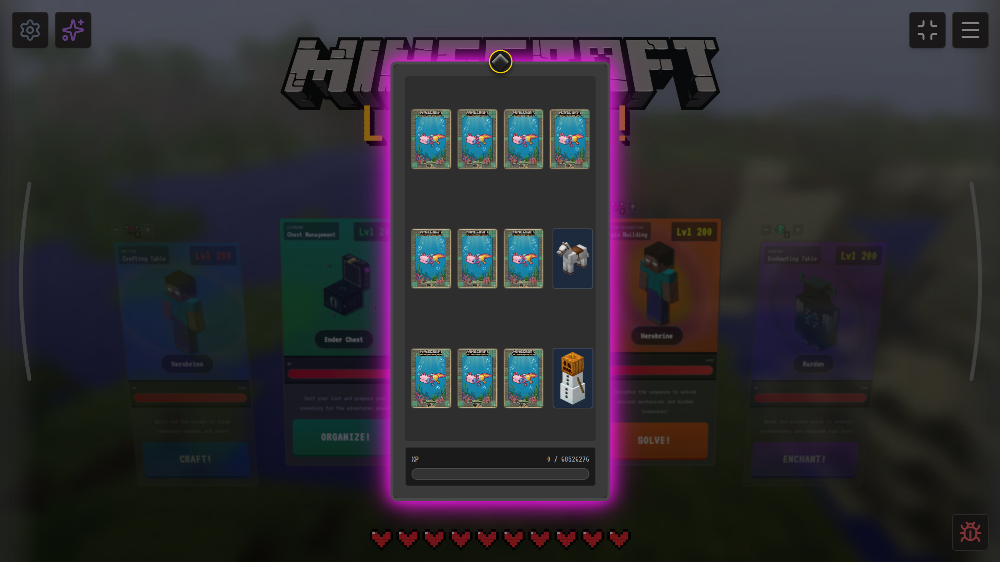
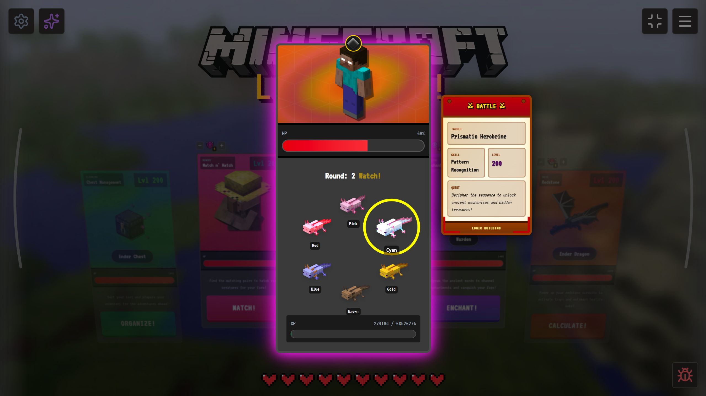

# Level-Up-RPG

Have fun!

## Download & Play (Windows)

Want to play the game without installing anything? Download the portable `.exe` file!

### Option 1: Download from Releases (Recommended)
1. Go to the [Releases page](https://github.com/FlashPaper42/Level-Up-RPG/releases)
2. Download the latest `LevelUpRPG-Portable.exe` file
3. Double-click the file to launch the game
4. **No installation required!** Perfect for sharing via flash drive

### Option 2: Download from GitHub Actions
1. Go to the [Actions tab](https://github.com/FlashPaper42/Level-Up-RPG/actions/workflows/build-exe.yml)
2. Click on the most recent successful workflow run (green checkmark)
3. Scroll down to the "Artifacts" section
4. Download `LevelUpRPG-Windows-Portable`
5. Extract the `.exe` file and double-click to play

## Features

### Reading Skill with Voice Recognition
The Reading skill uses your microphone to make learning interactive! Speak the words on screen to defeat enemies.

**Important Notes:**
- Click the microphone button to toggle listening on/off
- The mic automatically starts when you begin a Reading battle
- For detailed information about the microphone feature, see [docs/MICROPHONE_FEATURE.md](docs/MICROPHONE_FEATURE.md)

## Development

To run the game in development mode:
```bash
npm install
npm run dev
```

To build the Electron app locally:
```bash
npm run electron:build
```

## Documentation

- [Microphone Feature Guide](docs/MICROPHONE_FEATURE.md) - Complete guide to the voice recognition feature

## Screenshots

















